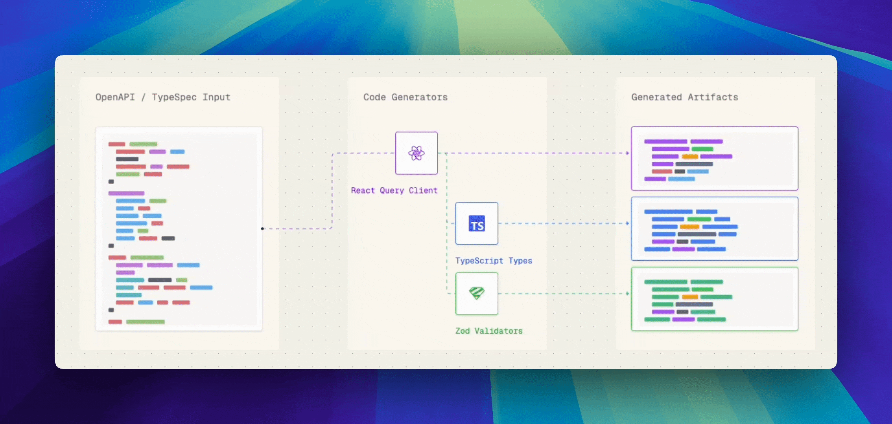

[](https://coveralls.io/github/skmtc/skmtc?branch=main)


**Skmtc is a declarative code generation framework**. It lets you generate TypeScript code from OpenAPI schemas without complex ASTs.

## ✨ Features

- 🏎️ **Fast** - Generates 550k+ tokens per second
- 🧵 **Easy to edit code generators** - Outputs specified using string templates, not ASTs
- 🥞 **Stackable generators** - Compose complex functionality by combining generators
- 🗄️ **Use your own code conventions** - Full control over naming and file structure

## 🚀 Quick Start

```bash
# Run directly with npx
npx skmtc

```

### Running code generators

```bash
npx skmtc generate @skmtc/supabase-backend https://petstore3.swagger.io/api/v3/openapi.json
# Generated 9 files (507 lines, 3,383 tokens) in 9ms

npx skmtc generate @skmtc/supabase-react-client https://raw.githubusercontent.com/cloudflare/api-schemas/refs/heads/main/openapi.json
# Generated 6,797 files (104,752 lines, 1,635,227 tokens) in 2,969ms
```

## How does it work?

Skmtc handles all OpenAPI parsing and output rendering, which means each generator only needs to specify how to represent its API schema input as a code string.

The process runs in 3 phases

1. **Parse** - Converts input OpenAPI schema into an **OasDocument** object
2. **Generate** - Creates **Projection** objects from operations and models in OasDocument and writes them to respective **File** objects
3. **Render** - Outputs generated **File** objects as code files

Let's take a look at an example, where we create a `fetch` based API client with Zod type checking

```typescript
import { ZodInsertable } from '@skmtc/gen-zod'

class ZodFetch extends BaseProjection {
  zodName: string;

  constructor({context, operation, settings}){
    super({context, operation, settings})

    // To add Zod type checks, we look up the response schema for each operation,
    const response = operation.toSuccessResponse()?.resolve().toSchema()

    // generate a Zod schema from it and insert it into current file
    const zodResponse = this.insert(ZodInsertable, response)

    // Assign schema name to object so it can be accessed from `toString()` below
    this.zodName = zodResponse.identifier.name
  }

  // Map object properties to output code
  toString(){
    return `() => {
      const res = await fetch('${this.operation.path}')
      const data = await res.json()

      return ${zodName}.parse(data)
    }`
  }
}
```


## 📦 Available Generators

Choose from our growing collection of generators, combone them or create your own:

- **Tanstack Query** - React Query hooks with Zod validation
- **MSW** - Mock Service Worker handlers from OpenAPI examples
- **Zod Schemas** - Runtime validation schemas
- **TypeScript Types** - Pure type definitions
- **Supabase/Hono Functions** - Edge function handlers
- See full list at https://github.com/skmtc/skmtc-generators

## ❓ FAQ

### **What OpenAPI versions are supported?**
Skmtc supports OpenAPI v3.0. Swagger 2.0 and OpenAPI v3.1 are automatically converted to OpenAPI v3.0.

### **Can I customize the generated code?**
Yes! Each Transformer specifies its output using plain string templates, which means you can
edit them as would you edit any other code.

### **Can I use this with my existing React app?**
Yes! Skmtc generates standalone code that integrates with any React application. The generated components work with your existing setup.

### **How does this compare to OpenAPI Generator?**
Skmtc is the only code generation framework that provides full control over the generated code. You are not limited by library-specific settings and you do not need to write complex AST code.

### **Does it work with Next.js/Remix/Vite?**
Yes! The generated code is framework-agnostic TypeScript that works with any build tool or library.

## 🤝 Contributing

We welcome contributions! Check out our [Contributing Guide](CONTRIBUTING.md) to get started.

<!-- ## 📚 Documentation

- [Full Documentation](https://docs.skmtc.dev)
- [API Reference](https://docs.skmtc.dev/api)
- [Custom Generators Guide](https://docs.skmtc.dev/generators)
- [Examples](https://github.com/skmtc/skmtc/tree/main/examples) -->

## 🛟 Support

- [GitHub Issues](https://github.com/skmtc/skmtc/issues) - Bug reports and feature requests
- [Discord Community](https://discord.com/invite/Mg88C8Xu5Y) - Get help and share your experience

## 📄 License

Apache 2.0 © [Skmtc Contributors](LICENSE.md)

---

[](https://opensource.org/licenses/Apache-2.0)
[](https://deno.land/)
[](https://discord.com/invite/Mg88C8Xu5Y)
