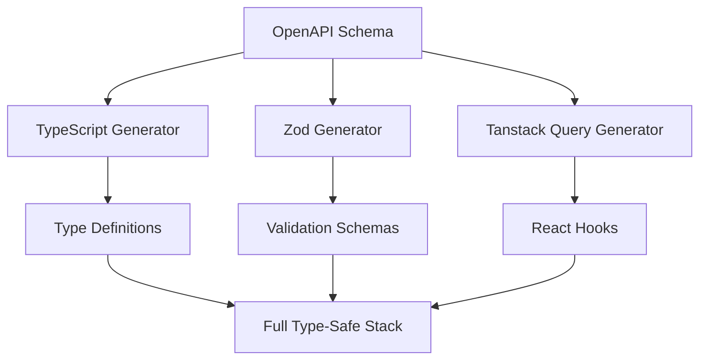

import { Callout } from 'fumadocs-ui/components/callout';

The generator system is the heart of Skmtc's extensibility. Generators are pluggable modules that transform OpenAPI schemas into code artifacts.

## What is a Generator?

A generator is a module that:
- Takes OpenAPI schemas as input
- Transforms them into code artifacts
- Can depend on other generators
- Produces typed, formatted output

```typescript
interface Generator {
  name: string;
  version: string;

  // Transform schema definitions
  transformModel?(args: TransformModelArgs): GeneratedValue[];

  // Transform API operations
  transformOperation?(args: TransformOperationArgs): GeneratedValue[];

  // Dependencies on other generators
  dependencies?: string[];

  // Configuration schema
  configSchema?: Schema;
}
```

## Generator Categories

Skmtc generators fall into several categories:

### Type Generators
Generate type definitions and interfaces:
- `@skmtc/gen-typescript` - TypeScript interfaces
- `@skmtc/gen-flow` - Flow type definitions
- `@skmtc/gen-graphql` - GraphQL type definitions

### Client Generators
Create API client code:
- `@skmtc/gen-fetch` - Fetch-based clients
- `@skmtc/gen-axios` - Axios clients
- `@skmtc/gen-ky` - Ky HTTP clients

### Validation Generators
Runtime validation schemas:
- `@skmtc/gen-zod` - Zod schemas
- `@skmtc/gen-yup` - Yup validation
- `@skmtc/gen-joi` - Joi schemas
- `@skmtc/gen-valibot` - Valibot schemas

### Framework Generators
Framework-specific integrations:
- `@skmtc/gen-tanstack-query` - React Query hooks
- `@skmtc/gen-swr` - SWR hooks
- `@skmtc/gen-vue-query` - Vue Query composables

### UI Generators
User interface components:
- `@skmtc/gen-shadcn-table` - Data tables
- `@skmtc/gen-shadcn-form` - Form components
- `@skmtc/gen-material-ui` - Material UI components

### Backend Generators
Server-side code:
- `@skmtc/gen-express` - Express routes
- `@skmtc/gen-fastify` - Fastify plugins
- `@skmtc/gen-hono` - Hono handlers
- `@skmtc/gen-supabase` - Supabase functions

### Testing Generators
Test utilities and mocks:
- `@skmtc/gen-msw` - Mock Service Worker handlers
- `@skmtc/gen-jest` - Jest test suites
- `@skmtc/gen-playwright` - E2E test scenarios

## Generator Composition

Generators can be combined to create powerful stacks:



### Dependency Resolution

Skmtc automatically resolves generator dependencies:

```json
{
  "generators": [
    "@skmtc/gen-tanstack-query-fetch-zod"
    // Automatically includes:
    // - @skmtc/gen-typescript
    // - @skmtc/gen-zod
    // - @skmtc/gen-fetch
  ]
}
```

### Smart Ordering

Generators execute in dependency order:

1. **Base generators** (TypeScript types)
2. **Dependent generators** (Zod schemas)
3. **Composite generators** (Tanstack Query hooks)

## Generator Lifecycle

### 1. Discovery Phase

Generators are discovered and loaded:

```typescript
// Skmtc searches for generators in:
// 1. Local .skmtc/generators folder
// 2. Node modules (@skmtc/gen-*)
// 3. Custom paths in config
const generators = await discoverGenerators();
```

### 2. Configuration Phase

Each generator receives configuration:

```json
{
  "generators": {
    "@skmtc/gen-typescript": {
      "enumStyle": "union",
      "dateType": "Date",
      "optionalStyle": "questionMark"
    },
    "@skmtc/gen-tanstack-query": {
      "version": 5,
      "customClient": true,
      "suspense": false
    }
  }
}
```

### 3. Transformation Phase

Generators transform schemas in parallel:

```typescript
// For each model/schema
generator.transformModel({
  model: OasModel,
  context: GenerateContext,
  config: GeneratorConfig,
  dependencies: DependencyResults
});

// For each operation/endpoint
generator.transformOperation({
  operation: OasOperation,
  context: GenerateContext,
  config: GeneratorConfig,
  dependencies: DependencyResults
});
```

### 4. Artifact Collection

Generated artifacts are collected:

```typescript
interface GeneratedArtifact {
  path: string;          // Output file path
  content: string;       // Generated code
  imports: Import[];     // Required imports
  exports: Export[];     // Exported symbols
  metadata: Metadata;    // Generator metadata
}
```

## Creating Custom Generators

Basic generator structure:

```typescript
// my-generator.ts
import { Generator, TransformModelArgs } from '@skmtc/core';

export default {
  name: 'my-generator',
  version: '1.0.0',

  transformModel({ model, config }) {
    const { name, properties } = model;

    // Generate code using string templates
    const content = `
      // Generated from ${model.source}
      export class ${name} {
        ${properties.map(prop =>
          `${prop.name}: ${prop.type};`
        ).join('\n        ')}
      }
    `;

    return [{
      path: `models/${name}.ts`,
      content,
      imports: [],
      exports: [{ name, type: 'class' }]
    }];
  },

  transformOperation({ operation, config }) {
    // Generate operation-specific code
    return [];
  }
} satisfies Generator;
```

## Generator Features

### Cross-Generator References

Generators can reference artifacts from dependencies:

```typescript
transformOperation({ operation, dependencies }) {
  // Get TypeScript type from dependency
  const responseType = dependencies['typescript']
    .getType(operation.responseSchema);

  // Use in generated code
  return `
    async function ${operation.name}(): Promise<${responseType}> {
      // Implementation
    }
  `;
}
```

### Enrichments

Generators can enrich schemas with additional data:

```typescript
interface Enrichments {
  // Add custom properties to models
  modelEnrichments?: Map<string, any>;

  // Add custom properties to operations
  operationEnrichments?: Map<string, any>;

  // Global enrichments
  globalEnrichments?: any;
}
```

### Conditional Generation

Skip generation based on conditions:

```typescript
transformModel({ model, config }) {
  // Skip internal models
  if (model.tags?.includes('internal')) {
    return [];
  }

  // Skip if configured
  if (config.skip?.includes(model.name)) {
    return [];
  }

  // Generate normally
  return [/* ... */];
}
```

## Generator Configuration

### Schema Validation

Define configuration schema with Valibot:

```typescript
import { object, string, boolean } from 'valibot';

const configSchema = object({
  style: string(),
  useInterfaces: boolean(),
  customBase: string().optional()
});

export default {
  name: 'my-generator',
  configSchema,
  // ...
} satisfies Generator;
```

### Default Configuration

Provide sensible defaults:

```typescript
const defaultConfig = {
  style: 'interface',
  useInterfaces: true,
  outputPath: 'generated'
};
```

### Per-Model Configuration

Override configuration per model:

```json
{
  "generators": {
    "@skmtc/gen-typescript": {
      "default": {
        "style": "interface"
      },
      "overrides": {
        "User": {
          "style": "class"
        }
      }
    }
  }
}
```

## Performance Optimization

### Parallel Processing

Generators run in parallel by default:

```typescript
// All independent generators execute simultaneously
await Promise.all(
  generators.map(gen => gen.transform(args))
);
```

### Caching

Generated artifacts are cached:

```typescript
// Cache key based on:
// - Schema hash
// - Generator version
// - Configuration
const cacheKey = hash(schema, generator, config);
```

### Incremental Generation

Only regenerate changed schemas:

```typescript
if (await cache.isValid(model, lastGenerated)) {
  return cache.get(model);
}
```

## Best Practices

### 1. Single Responsibility

Each generator should do one thing well:

```typescript
// Good: Focused generators
'@skmtc/gen-typescript'     // Only types
'@skmtc/gen-zod'            // Only validation
'@skmtc/gen-react-query'    // Only hooks

// Bad: Monolithic generator
'@skmtc/gen-everything'     // Does too much
```

### 2. Composition Over Configuration

Use multiple generators instead of complex configuration:

```typescript
// Good: Compose generators
generators: [
  '@skmtc/gen-typescript',
  '@skmtc/gen-zod',
  '@skmtc/gen-tanstack-query'
]

// Bad: Single generator with flags
generators: [{
  name: '@skmtc/gen-all',
  config: {
    generateTypes: true,
    generateValidation: true,
    generateHooks: true
  }
}]
```

### 3. Preserve Source Information

Include source comments and documentation:

```typescript
transformModel({ model }) {
  return `
    /**
     * ${model.description}
     * @source ${model.source}
     * @generated ${new Date().toISOString()}
     */
    export interface ${model.name} {
      // ...
    }
  `;
}
```

### 4. Handle Edge Cases

Account for OpenAPI quirks:

```typescript
transformModel({ model }) {
  // Handle empty objects
  if (!model.properties?.length) {
    return `export type ${model.name} = Record<string, unknown>;`;
  }

  // Handle circular references
  if (model.circular) {
    return `export interface ${model.name} { /* circular */ }`;
  }

  // Normal generation
  // ...
}
```

## Debugging Generators

### Enable Debug Output

```bash
SKMTC_DEBUG=generators skmtc generate
```

### Trace Generator Execution

```typescript
transformModel({ model, context }) {
  context.trace('transform-model', () => {
    context.log('Processing model', { name: model.name });
    // Generation logic
  });
}
```

### Test Generators

```typescript
// __tests__/my-generator.test.ts
import { testGenerator } from '@skmtc/testing';
import myGenerator from '../my-generator';

test('generates correct interface', async () => {
  const result = await testGenerator(myGenerator, {
    model: {
      name: 'User',
      properties: [
        { name: 'id', type: 'string' }
      ]
    }
  });

  expect(result).toContain('interface User');
  expect(result).toContain('id: string');
});
```

## Publishing Generators

### Package Structure

```
my-generator/
├── package.json
├── README.md
├── src/
│   ├── index.ts       # Main generator
│   ├── config.ts      # Configuration schema
│   └── templates/     # String templates
├── tests/
└── examples/
```

### Package.json

```json
{
  "name": "@skmtc/gen-my-generator",
  "version": "1.0.0",
  "main": "dist/index.js",
  "types": "dist/index.d.ts",
  "keywords": ["skmtc", "generator", "openapi"],
  "peerDependencies": {
    "@skmtc/core": "^1.0.0"
  }
}
```

### Publishing

```bash
# Build
npm run build

# Test
npm test

# Publish to npm
npm publish --access public

# Or publish to JSR
deno publish
```

## Next Steps

<Cards>
  <Card
    title="Available Generators"
    description="Browse all available generators"
    href="/docs/generators"
  />
  <Card
    title="Creating Generators"
    description="Build your own generator"
    href="/docs/creating-generators/basics"
  />
  <Card
    title="Generator API"
    description="Complete API reference"
    href="/docs/creating-generators/api"
  />
</Cards>

<Callout type="tip">
**Pro Tip:** Start by extending an existing generator rather than building from scratch. Many generators are open source and can serve as templates.
</Callout>