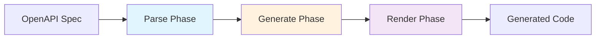

import { Callout } from 'fumadocs-ui/components/callout';

Skmtc transforms OpenAPI specifications into production-ready code through a carefully designed three-phase pipeline. This architecture ensures reliability, extensibility, and maintainability.

## The Three-Phase Pipeline



Each phase has a specific responsibility and passes structured data to the next phase:

### 1. Parse Phase

**Input:** OpenAPI v3 JSON document
**Output:** Normalized OAS (OpenAPI Schema) objects
**Context:** `ParseContext`

The parse phase:
- Validates the OpenAPI document structure
- Converts Swagger 2.0 and OpenAPI 3.1 to v3.0
- Resolves `$ref` references
- Merges `allOf` schemas with conflict detection
- Builds an internal representation optimized for code generation

```typescript
// Internally, Skmtc creates structured objects
const parseResult = {
  models: Map<ModelGeneratorKey, OasModel>,
  operations: Map<OperationGeneratorKey, OasOperation>,
  document: OasDocument,
  issues: ParseIssue[]
};
```

### 2. Generate Phase

**Input:** OAS objects from Parse phase
**Output:** Generator-specific artifacts
**Context:** `GenerateContext`

The generate phase:
- Applies each generator to the parsed schemas
- Transforms OAS objects into language-specific code
- Manages generator dependencies and ordering
- Handles cross-generator references
- Produces intermediate artifacts

```typescript
// Each generator produces artifacts
const artifacts = {
  files: Map<string, GeneratedFile>,
  imports: ImportRegistry,
  metadata: GeneratorMetadata
};
```

### 3. Render Phase

**Input:** Artifacts from Generate phase
**Output:** Formatted files on disk
**Context:** `RenderContext`

The render phase:
- Organizes files into the target directory structure
- Applies code formatting (Prettier)
- Handles file writing and overwrites
- Manages import resolution
- Generates index files and re-exports

## Why This Architecture?

### Separation of Concerns

Each phase has a single responsibility:
- **Parse** only cares about understanding OpenAPI
- **Generate** only cares about creating code
- **Render** only cares about file management

This makes the system easier to understand, test, and extend.

### Extensibility

The pipeline architecture makes it easy to:
- Add new generators without modifying the core
- Support new OpenAPI versions
- Implement custom transformations
- Add pre/post processing hooks

### Reliability

The phased approach provides:
- Early validation and error detection
- Consistent error handling across phases
- Rollback capabilities if generation fails
- Detailed logging and tracing

## Key Components

### Context System

Each phase has its own context object that provides:

```typescript
interface PhaseContext {
  // Logging with structured data
  log(level: LogLevel, message: string, data?: any): void;

  // Distributed tracing
  trace(spanName: string, fn: () => T): T;

  // Error collection
  addIssue(issue: Issue): void;

  // Phase-specific utilities
  utils: PhaseUtils;
}
```

### Generator System

Generators are pluggable modules that transform schemas:

```typescript
interface Generator {
  name: string;
  version: string;

  // Transform models (schemas)
  transformModel?(args: TransformModelArgs): GeneratedValue[];

  // Transform operations (endpoints)
  transformOperation?(args: TransformOperationArgs): GeneratedValue[];

  // Dependencies on other generators
  dependencies?: string[];
}
```

### DSL (Domain-Specific Language)

Skmtc provides a DSL for building code:

```typescript
// Instead of string concatenation
const code = `export interface ${name} {\n${fields.join('\n')}\n}`;

// Use the DSL
const code = new InterfaceBuilder(name)
  .addFields(fields)
  .addComment(description)
  .build();
```

## String Templates vs AST

<Callout type="info">
**Key Design Decision:** Skmtc uses string templates instead of Abstract Syntax Trees (AST) for code generation.
</Callout>

### Why String Templates?

**1. Simplicity**
```typescript
// String template - easy to understand and edit
`export interface ${name} {
  ${fields.map(f => `${f.name}: ${f.type};`).join('\n  ')}
}`

// AST - complex and verbose
factory.createInterfaceDeclaration(
  undefined,
  [factory.createModifier(ts.SyntaxKind.ExportKeyword)],
  factory.createIdentifier(name),
  undefined,
  undefined,
  fields.map(f =>
    factory.createPropertySignature(
      undefined,
      factory.createIdentifier(f.name),
      undefined,
      factory.createTypeReferenceNode(f.type)
    )
  )
)
```

**2. Flexibility**
- Easy to customize output format
- Simple to add comments and documentation
- Direct control over whitespace and formatting
- Language-agnostic approach

**3. Maintainability**
- Developers can see exactly what will be generated
- No need to learn AST manipulation APIs
- Easier to debug and test
- Templates can be extracted and reused

### Trade-offs

While string templates are simpler, they require:
- Careful escaping of special characters
- Manual handling of imports
- Post-processing with formatters (Prettier)

Skmtc handles these concerns automatically in the Render phase.

## Execution Flow

Here's how a typical generation works:

```typescript
// 1. User runs command
skmtc generate openapi.json

// 2. Core orchestration
const context = new CoreContext(config);
const result = await context.run(async () => {

  // 3. Parse Phase
  const parseContext = new ParseContext();
  const oasObjects = await parseContext.parse(openapiJson);

  // 4. Generate Phase
  const generateContext = new GenerateContext(oasObjects);
  for (const generator of generators) {
    await generateContext.runGenerator(generator);
  }
  const artifacts = generateContext.getArtifacts();

  // 5. Render Phase
  const renderContext = new RenderContext(artifacts);
  await renderContext.render(outputDirectory);
});
```

## Advanced Features

### Schema Merging

Skmtc handles complex OpenAPI features like `allOf`:

```yaml
Pet:
  allOf:
    - $ref: '#/components/schemas/Animal'
    - type: object
      properties:
        breed:
          type: string
```

The parser intelligently merges these schemas, detecting and resolving conflicts.

### Incremental Generation

For large APIs, Skmtc supports incremental generation:

```typescript
// Only regenerate what changed
skmtc generate --incremental --watch
```

### Custom Phases

Advanced users can insert custom phases:

```typescript
import { CustomPhase } from '@skmtc/core';

const pipeline = createPipeline({
  phases: [
    parsePhase,
    customValidationPhase, // Your custom phase
    generatePhase,
    customPostProcessPhase, // Another custom phase
    renderPhase
  ]
});
```

## Performance Characteristics

Skmtc is designed for speed:

- **Parsing:** ~100ms for typical APIs (50 endpoints)
- **Generation:** ~10ms per generator
- **Rendering:** ~50ms including Prettier formatting
- **Total:** Usually under 1 second for complete generation

### Optimization Techniques

1. **Lazy evaluation** - Only process what's needed
2. **Parallel processing** - Generators run concurrently
3. **Caching** - Parsed schemas are cached
4. **Streaming** - Large files are processed in chunks

## Debugging and Tracing

Skmtc provides comprehensive debugging tools:

```bash
# Enable debug logging
SKMTC_LOG_LEVEL=debug skmtc generate

# Enable tracing
SKMTC_TRACE=true skmtc generate

# Write trace to file
SKMTC_TRACE_FILE=trace.json skmtc generate
```

The trace output shows:
- Time spent in each phase
- Generator execution order
- File I/O operations
- Error locations and stack traces

## Next Steps

<Cards>
  <Card
    title="OpenAPI Support"
    description="Learn about supported OpenAPI features"
    href="/docs/concepts/openapi-support"
  />
  <Card
    title="Generator System"
    description="Deep dive into how generators work"
    href="/docs/concepts/generator-system"
  />
  <Card
    title="Creating Generators"
    description="Build your own custom generators"
    href="/docs/creating-generators/basics"
  />
</Cards>